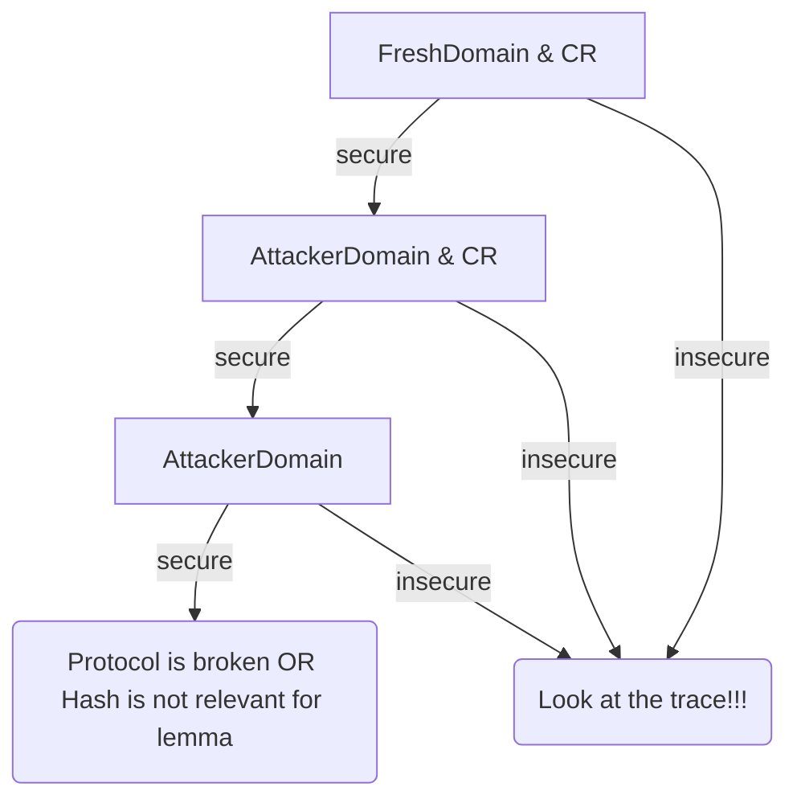

# Tamarin Hash Library

## Description

The file `HashLibrary.splib` provides a library that enables an in depth verification of a tamarin model w.r.t. the hash function modeling.

## Usage

First, the library must be included inside the target spthy file, using `#include "HashLibrary.splib"`, and the builtin for associative concatenation must be added with `builtins: concatenation`.

Then, instead of using a unary function symbol `h` to model hash computations, one must now use the dedicated `HashC` event.

For instance, the rule:
```
[In(x)]-->[Out(h(x))]
```
Should now be encoded as:
```
[In(x)]--[HashC(x,hx)]->[Out(hx)]
```
Notice that `hx` here represents a free variable in the rule, but it will be bound to a coherent value based on restrictions and rules defined in the library file.

The library then contains multiple flags, that allow to enable multiple hash function behaviours. The target file can be executed with the multiple options described in the next section with the command:
```
tamarin-prover target.spthy -D=Param1 ... -D=Paramn
```

The file `Example_HashLibrary_usage.sthy` gives a usage example.


Reserved facts: HashE, HashC, SingleHash, !HashVals, Token, FixedLength.

## Options


### Output domain of the hash

There are two main parameter that are incompatible,`-D=AttackerDomain` and `-D=FreshDomain`.

The attacker domain means that the attacker actually chooses the output value of the hash function, even for inputs it does not know. The fresh domain means that a hash output value will always be a fresh name (of the form `~n`).

Without further restriction, the attacker can in both cases pick values from the output domain and thus create arbitrary collisions.  Further, as the attacker can essentially collapse the hash function to a single point, those modeling implies that there is no PreImage or Second Pre-image resistance.

#### Fresh Domain

When the output domain are fresh values, the attacker can only know the value of a hash output if it can compute the corresponding input.

#### Attacker Domain

In this case, as the attacker chooses the output values, even for input values it does not know, the attacker can effectively guess any hash value. This model is interesting when the security of the protocol does not rely on any secret value of a hash, and it typically allows to capture typings attacks, e.g. what if a hash value can be confused with a pair.

### Attacker restrictions: Collision resistance

In addition to the output domain, one can specify that the hash function is collision resistant with the flag `-D=CR`. This will in the classical way imply PreImage and Second PreImage resistance.

### Attacker Capabilities

Those give to the attacker few computation capabilities, each of the following flags can be combined in arbitrary ways. Note though that combining them with the `CR` flag is not useful, as `CR` takes priority on the other capabilities and effectively forbid them.

For those capalities, and independent flag `-D=Single` allows to specify that only one such computation is allowed to the attacker, which may reduce the search space.


#### Preimage based

 * `-D=PreImage`: Given a hash value `hx`, the attacker can compute an element `x` which is the preimage of `hx`.
 * `-D=SndPreImage`: Given a value `x`, the attacker can compute an element `y` such that they both have the same hash output value.

#### Concatenation based
Some features are linked to the associative concatenation symbol `||`.

 * `-D=LengthExtension`: Given some value `x` and some hash value `hy` corresponding to input `y`, even without `y`, the attacker can compute the hash value of `x||y`.

 * `-D=CPcol`: Given two prefixes `p1` and `p2`, the attacker can compute two suffix `s1` and `s2` such that `p1||s1` and `p2||s2` are a collision. Such collisions can be extended with a common suffix `l` as  `p1||s1||l` and `p2||s2||l`.

For the `CPcol` cases, when concatenation of many values are hashed, e.g. `a||b||c||d||e||f`, the complexity can increase rapidly. To tame it, and additional event `FixedLength` is provided, that allows to specify that a variable cannot receive any value `s1` or `s2` corresponding to a chosen prefix collision, intuitively because this variable in practice only accepts fixed length input, while the suffixes tend to be long values. Raising `FixedLength(b)` will ensure that `b` is never equal to some `s1` or `s2`.

## Workflow

The weakest hash model is `-D=AttackerDomain`, and the strongest is `-D=FreshDomain -D=CR`.


For sanity, it is recommended to check that the protocol is secure with the strongest model, and to see which properties break with the weakest one. Then, one can investigate on this subset of properties what level of security they require from the hash function.

To decide which domain to use, one should check the model with `-D=AttackerDomain -D=CR`, and if some secure properties are broken here, then it means that the protocol does rely on some secrecy property from the hash output values, and thus one should use the `-D=FreshDomain` flag, and otherwise stick with `-D=AttackerDomain`.

The following relations exists between the flags:

`-D=PreImage` => `-D=SndPreimage`

`-D=AttackerDomain` => `-D=LengthExtension`

`-D=CR` => not(`-D=PreImage`) & not(`-D=SndPreImage`) & not(`-D=CPcol`)





